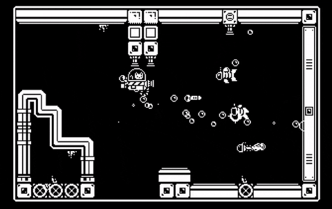

<!--
**jerewy/jerewy** is a ✨ _special_ ✨ repository because its `README.md` (this file) appears on your GitHub profile.

Here are some ideas to get you started:

- 🔭 I’m currently working on ...
- 🌱 I’m currently learning ...
- 👯 I’m looking to collaborate on ...
- 🤔 I’m looking for help with ...
- 💬 Ask me about ...
- 📫 How to reach me: ...
- 😄 Pronouns: ...
- ⚡ Fun fact: ...
-->

  

<h1 align="center">Hi there, I'm Jeremy Wijaya 👋</h1>
<h3 align="center">An AI & Software Developer from Indonesia, building intelligent solutions with code.</h3>

---

### 👨‍💻 About Me

As a computer science student, I'm passionate about the intersection of data and user experience. I love building predictive models that uncover hidden stories and then bringing those insights to life through intuitive web applications.

- 🔭 I’m currently building a **Website called CodeJoin** with NEXT.JS and supabase.
- 🌱 I’m deepening my skills in **AI**.
- 👯 I’m looking to collaborate on **open-source web applications**.
- 📫 You can reach me at: **jeremywijaya81@gmail.com**

---

### 🛠️ My Tech Stack & Tools

  
  
  
  
  

---

### 📊 My GitHub Stats

  
  &nbsp;
  

---

### 🌐 Connect with Me

